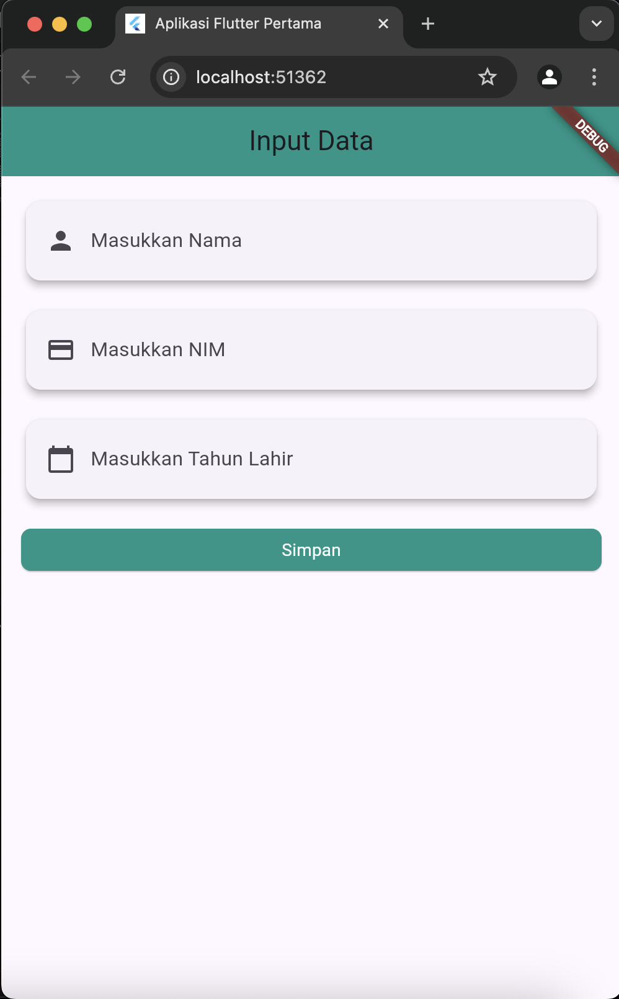
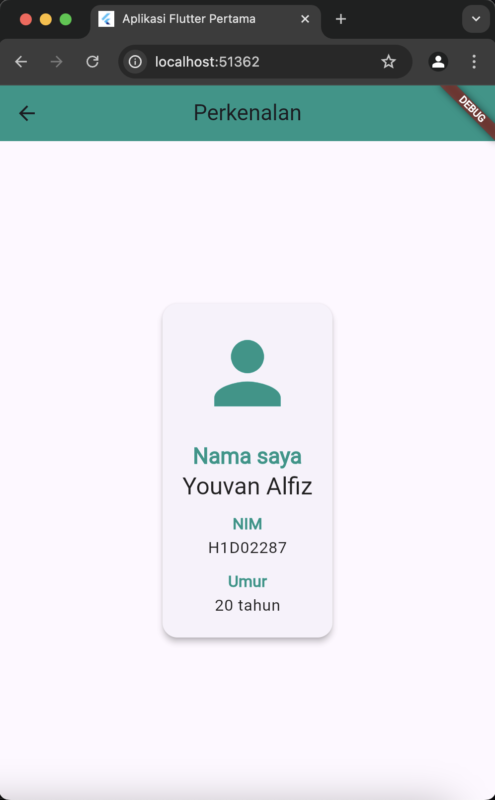

# Tugas Pertemuan 2

Nama : Youvan Alfiz Farandi Putra Hermawan

NIM : H1D022087

Shift Baru: A

Proses Passing Data

1. Inisialisasi Kontroler dan Widget:
    Pada widget FormData, tiga kontroler TextEditingController dibuat untuk menangani input teks dari pengguna (_namaController, _nimController, _tahunController).
2. Pengguna Memasukkan Data:
    Pengguna mengisi data dalam tiga TextField yang terletak dalam widget FormData. Masing-masing TextField menggunakan kontroler untuk mengakses teks yang dimasukkan oleh pengguna.
3. Mengambil Data dari Kontroler:
    Ketika tombol "Simpan" diklik, data dari kontroler diambil: nama, nim, dan tahun.
4. Navigasi ke TampilData:
    Data yang diambil dari kontroler kemudian digunakan untuk membuat instance baru dari widget TampilData melalui Navigator.of(context).push.
5. Meneruskan Data ke TampilData:
    Data yang diambil (nama, nim, dan tahun) diteruskan ke widget TampilData melalui konstruktor.
6. Menampilkan Data di TampilData:
    Di dalam widget TampilData, data yang diterima ditampilkan dalam format yang terstruktur, termasuk menghitung umur berdasarkan tahun yang dimasukkan.

## Screenshot
Contoh :

